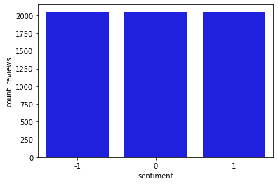

# Feature transformation with Amazon SageMaker processing job and Feature Store

### Introduction

In this lab you will start with the raw [Women's Clothing Reviews](https://www.kaggle.com/nicapotato/womens-ecommerce-clothing-reviews) dataset and prepare it to train a BERT-based natural language processing (NLP) model. The model will be used to classify customer reviews into positive (1), neutral (0) and negative (-1) sentiment.

You will convert the original review text into machine-readable features used by BERT. To perform the required feature transformation you will configure an Amazon SageMaker processing job, which will be running a custom Python script.

### Table of Contents

- [1. Configure the SageMaker Feature Store](#c2w1-1.)
  - [1.1. Configure dataset](#c2w1-1.1.)
  - [1.2. Configure the SageMaker feature store](#c2w1-1.2.)
    - [Exercise 1](#c2w1-ex-1)
- [2. Transform the dataset](#c2w1-2.)
    - [Exercise 2](#c2w1-ex-2)
    - [Exercise 3](#c2w1-ex-3)
- [3. Query the Feature Store](#c2w1-3.)
  - [3.1. Export training, validation, and test datasets from the Feature Store](#c2w1-3.1.)
    - [Exercise 4](#c2w1-ex-4)
  - [3.2. Export TSV from Feature Store](#c2w1-3.2.)
  - [3.3. Check that the dataset in the Feature Store is balanced by sentiment](#c2w1-3.3.)
    - [Exercise 5](#c2w1-ex-5)
    - [Exercise 6](#c2w1-ex-6)
    - [Exercise 7](#c2w1-ex-7)


```python
# please ignore warning messages during the installation
!pip install --disable-pip-version-check -q sagemaker==2.35.0
!conda install -q -y pytorch==1.6.0 -c pytorch
!pip install --disable-pip-version-check -q transformers==3.5.1
```

    /opt/conda/lib/python3.7/site-packages/secretstorage/dhcrypto.py:16: CryptographyDeprecationWarning: int_from_bytes is deprecated, use int.from_bytes instead
      from cryptography.utils import int_from_bytes
    /opt/conda/lib/python3.7/site-packages/secretstorage/util.py:25: CryptographyDeprecationWarning: int_from_bytes is deprecated, use int.from_bytes instead
      from cryptography.utils import int_from_bytes
    WARNING: Running pip as root will break packages and permissions. You should install packages reliably by using venv: https://pip.pypa.io/warnings/venv
    Collecting package metadata (current_repodata.json): ...working... done
    Solving environment: ...working... done
    
    ## Package Plan ##
    
      environment location: /opt/conda
    
      added / updated specs:
        - pytorch==1.6.0
    
    
    The following packages will be downloaded:
    
        package                    |            build
        ---------------------------|-----------------
        ca-certificates-2021.5.25  |       h06a4308_1         112 KB
        certifi-2021.5.30          |   py37h06a4308_0         139 KB
        conda-4.10.1               |   py37h06a4308_1         2.9 MB
        cudatoolkit-10.2.89        |       hfd86e86_1       365.1 MB
        ninja-1.10.2               |       hff7bd54_1         1.4 MB
        pytorch-1.6.0              |py3.7_cuda10.2.89_cudnn7.6.5_0       537.7 MB  pytorch
        ------------------------------------------------------------
                                               Total:       907.3 MB
    
    The following NEW packages will be INSTALLED:
    
      cudatoolkit        pkgs/main/linux-64::cudatoolkit-10.2.89-hfd86e86_1
      ninja              pkgs/main/linux-64::ninja-1.10.2-hff7bd54_1
      pytorch            pytorch/linux-64::pytorch-1.6.0-py3.7_cuda10.2.89_cudnn7.6.5_0
    
    The following packages will be UPDATED:
    
      ca-certificates    conda-forge::ca-certificates-2020.12.~ --> pkgs/main::ca-certificates-2021.5.25-h06a4308_1
      certifi            conda-forge::certifi-2020.12.5-py37h8~ --> pkgs/main::certifi-2021.5.30-py37h06a4308_0
      conda              conda-forge::conda-4.10.1-py37h89c186~ --> pkgs/main::conda-4.10.1-py37h06a4308_1
    
    
    Preparing transaction: ...working... done
    Verifying transaction: ...working... done
    Executing transaction: ...working... done
    /opt/conda/lib/python3.7/site-packages/secretstorage/dhcrypto.py:16: CryptographyDeprecationWarning: int_from_bytes is deprecated, use int.from_bytes instead
      from cryptography.utils import int_from_bytes
    /opt/conda/lib/python3.7/site-packages/secretstorage/util.py:25: CryptographyDeprecationWarning: int_from_bytes is deprecated, use int.from_bytes instead
      from cryptography.utils import int_from_bytes
    WARNING: Running pip as root will break packages and permissions. You should install packages reliably by using venv: https://pip.pypa.io/warnings/venv


```python
import sagemaker
import boto3

sess = sagemaker.Session()
role = sagemaker.get_execution_role()
bucket = sess.default_bucket()
region = boto3.Session().region_name
```

<a name='c2w1-1.'></a>
# 1. Configure the SageMaker Feature Store

<a name='c2w1-1.1.'></a>
### 1.1. Configure dataset
The raw dataset is in the public S3 bucket. Let's start by specifying the S3 location of it:


```python
raw_input_data_s3_uri = 's3://dlai-practical-data-science/data/raw/'
print(raw_input_data_s3_uri)
```

    s3://dlai-practical-data-science/data/raw/


List the files in the S3 bucket (in this case it will be just one file):


```python
!aws s3 ls $raw_input_data_s3_uri
```

    2021-04-30 02:21:06    8457214 womens_clothing_ecommerce_reviews.csv


<a name='c2w1-1.2.'></a>
### 1.2. Configure the SageMaker feature store

As the result of the transformation, in addition to generating files in S3 bucket, you will also save the transformed data in the **Amazon SageMaker Feature Store** to be used by others in your organization, for example. 

To configure a Feature Store you need to setup a **Feature Group**. This is the main resource containing all of the metadata related to the data stored in the Feature Store. A Feature Group should contain a list of **Feature Definitions**. A Feature Definition consists of a name and the data type. The Feature Group also contains an online store configuration and an offline store configuration controlling where the data is stored. Enabling the online store allows quick access to the latest value for a record via the [GetRecord API](https://docs.aws.amazon.com/sagemaker/latest/APIReference/API_feature_store_GetRecord.html). The offline store allows storage of the data in your S3 bucket. You will be using the offline store in this lab.

Let's setup the Feature Group name and the Feature Store offline prefix in S3 bucket (you will use those later in the lab):


```python
import time
timestamp = int(time.time())

feature_group_name = 'reviews-feature-group-' + str(timestamp)
feature_store_offline_prefix = 'reviews-feature-store-' + str(timestamp)

print('Feature group name: {}'.format(feature_group_name))
print('Feature store offline prefix in S3: {}'.format(feature_store_offline_prefix))
```

    Feature group name: reviews-feature-group-1622796994
    Feature store offline prefix in S3: reviews-feature-store-1622796994


Taking two features from the original raw dataset (`Review Text` and `Rating`), you will transform it preparing to be used for the model training and then to be saved in the Feature Store. Here you will define the related features to be stored as a list of `FeatureDefinition`.


```python
from sagemaker.feature_store.feature_definition import (
    FeatureDefinition,
    FeatureTypeEnum,
)

feature_definitions= [
    # unique ID of the review
    FeatureDefinition(feature_name='review_id', feature_type=FeatureTypeEnum.STRING), 
    # ingestion timestamp
    FeatureDefinition(feature_name='date', feature_type=FeatureTypeEnum.STRING),
    # sentiment: -1 (negative), 0 (neutral) or 1 (positive). It will be found the Rating values (1, 2, 3, 4, 5)
    FeatureDefinition(feature_name='sentiment', feature_type=FeatureTypeEnum.STRING), 
    # label ID of the target class (sentiment)
    FeatureDefinition(feature_name='label_id', feature_type=FeatureTypeEnum.STRING),
    # reviews encoded with the BERT tokenizer
    FeatureDefinition(feature_name='input_ids', feature_type=FeatureTypeEnum.STRING),
    # original Review Text
    FeatureDefinition(feature_name='review_body', feature_type=FeatureTypeEnum.STRING),
    # train/validation/test label
    FeatureDefinition(feature_name='split_type', feature_type=FeatureTypeEnum.STRING)
]
```

<a name='c2w1-ex-1'></a>
### Exercise 1

Create the feature group using the feature definitions defined above.

**Instructions:** Use the `FeatureGroup` function passing the defined above feature group name and the feature definitions.

```python
feature_group = FeatureGroup(
    name=..., # Feature Group name
    feature_definitions=..., # a list of Feature Definitions
    sagemaker_session=sess # SageMaker session
)
```


```python
from sagemaker.feature_store.feature_group import FeatureGroup

feature_group = FeatureGroup(
    ### BEGIN SOLUTION - DO NOT delete this comment for grading purposes
    name=feature_group_name, # Replace None
    feature_definitions=feature_definitions, # Replace None
    ### END SOLUTION - DO NOT delete this comment for grading purposes
    sagemaker_session=sess
)

print(feature_group)
```

    FeatureGroup(name='reviews-feature-group-1622796994', sagemaker_session=<sagemaker.session.Session object at 0x7f3cc05d1450>, feature_definitions=[FeatureDefinition(feature_name='review_id', feature_type=<FeatureTypeEnum.STRING: 'String'>), FeatureDefinition(feature_name='date', feature_type=<FeatureTypeEnum.STRING: 'String'>), FeatureDefinition(feature_name='sentiment', feature_type=<FeatureTypeEnum.STRING: 'String'>), FeatureDefinition(feature_name='label_id', feature_type=<FeatureTypeEnum.STRING: 'String'>), FeatureDefinition(feature_name='input_ids', feature_type=<FeatureTypeEnum.STRING: 'String'>), FeatureDefinition(feature_name='review_body', feature_type=<FeatureTypeEnum.STRING: 'String'>), FeatureDefinition(feature_name='split_type', feature_type=<FeatureTypeEnum.STRING: 'String'>)])


You will use the defined Feature Group later in this lab, the actual creation of the Feature Group will take place in the processing job. Now let's move into the setup of the processing job to transform the dataset.

<a name='c2w1-2.'></a>
# 2. Transform the dataset

You will configure a SageMaker processing job to run a custom Python script to balance and transform the raw data into a format used by BERT model.

Set the transformation parameters including the instance type, instance count, and train/validation/test split percentages. You can also choose whether you want to balance the dataset or not. In this case, you will balance the dataset to avoid class imbalance in the target variable, `sentiment`. 

Another important parameter of the model is the `max_seq_length`, which specifies the maximum length of the classified reviews for the RoBERTa model. If the sentence is shorter than the maximum length parameter, it will be padded. In another case, when the sentence is longer, it will be truncated from the right side.

Since a smaller `max_seq_length` leads to faster training and lower resource utilization, you want to find the smallest power-of-2 that captures `100%` of our reviews.  For this dataset, the `100th` percentile is `115`.  However, it's best to stick with powers-of-2 when using BERT. So let's choose `128` as this is the smallest power-of-2 greater than `115`. You will see below how the shorter sentences will be padded to a maximum length.


```
mean        52.512374
std         31.387048
min          1.000000
10%         10.000000
20%         22.000000
30%         32.000000
40%         41.000000
50%         51.000000
60%         61.000000
70%         73.000000
80%         88.000000
90%         97.000000
100%       115.000000
max        115.000000
```


```python
processing_instance_type='ml.c5.xlarge'
processing_instance_count=1
train_split_percentage=0.90
validation_split_percentage=0.05
test_split_percentage=0.05
balance_dataset=True
max_seq_length=128
```

To balance and transform our data, we will use a scikit-learn-based processing job. This is essentially a generic Python processing job with scikit-learn pre-installed.  We can specify the version of scikit-learn we wish to use. Also pass the SageMaker execution role, processing instance type and instance count.


```python
from sagemaker.sklearn.processing import SKLearnProcessor

processor = SKLearnProcessor(
    framework_version='0.23-1',
    role=role,
    instance_type=processing_instance_type,
    instance_count=processing_instance_count,
    env={'AWS_DEFAULT_REGION': region},                             
    max_runtime_in_seconds=7200
)
```

The processing job will be running the Python code from the file `src/prepare_data.py`. In the following exercise you will review the contents of the file and familiarize yourself with main parts of it. 

<a name='c2w1-ex-2'></a>
### Exercise 2

1. Open the file [src/prepare_data.py](src/prepare_data.py). Go through the comments to understand its content.
2. Find and review the `convert_to_bert_input_ids()` function, which contains the RoBERTa `tokenizer` configuration.
3. Complete method `encode_plus` of the RoBERTa `tokenizer`. Pass the `max_seq_length` as a value for the argument `max_length`. It defines a pad to a maximum length specified.
4. Save the file [src/prepare_data.py](src/prepare_data.py). 

### _This cell will take approximately 1-2 minutes to run._


```python
import sys, importlib
sys.path.append('src/')

# import the `prepare_data.py` module
import prepare_data

# reload the module if it has been previously loaded 
if 'prepare_data' in sys.modules:
    importlib.reload(prepare_data)

input_ids = prepare_data.convert_to_bert_input_ids("this product is great!", max_seq_length)
    
updated_correctly = False

if len(input_ids) != max_seq_length:
    print('#######################################################################################################')
    print('Please check that the function \'convert_to_bert_input_ids\' in the file src/prepare_data.py is complete.')
    print('#######################################################################################################')
    raise Exception('Please check that the function \'convert_to_bert_input_ids\' in the file src/prepare_data.py is complete.')
else:
    print('##################')
    print('Updated correctly!')
    print('##################')

    updated_correctly = True
```

    ##################
    Updated correctly!
    ##################


Review the results of tokenization for the given example (*\"this product is great!\"*):


```python
input_ids = prepare_data.convert_to_bert_input_ids("this product is great!", max_seq_length)

print(input_ids)
print('Length of the sequence: {}'.format(len(input_ids)))
```

    [0, 9226, 1152, 16, 372, 328, 2, 1, 1, 1, 1, 1, 1, 1, 1, 1, 1, 1, 1, 1, 1, 1, 1, 1, 1, 1, 1, 1, 1, 1, 1, 1, 1, 1, 1, 1, 1, 1, 1, 1, 1, 1, 1, 1, 1, 1, 1, 1, 1, 1, 1, 1, 1, 1, 1, 1, 1, 1, 1, 1, 1, 1, 1, 1, 1, 1, 1, 1, 1, 1, 1, 1, 1, 1, 1, 1, 1, 1, 1, 1, 1, 1, 1, 1, 1, 1, 1, 1, 1, 1, 1, 1, 1, 1, 1, 1, 1, 1, 1, 1, 1, 1, 1, 1, 1, 1, 1, 1, 1, 1, 1, 1, 1, 1, 1, 1, 1, 1, 1, 1, 1, 1, 1, 1, 1, 1, 1, 1]
    Length of the sequence: 128


Launch the processing job with the custom script passing defined above parameters.


```python
from sagemaker.processing import ProcessingInput, ProcessingOutput

if (updated_correctly):

    processor.run(code='src/prepare_data.py',
              inputs=[
                    ProcessingInput(source=raw_input_data_s3_uri,
                                    destination='/opt/ml/processing/input/data/',
                                    s3_data_distribution_type='ShardedByS3Key')
              ],
              outputs=[
                    ProcessingOutput(output_name='sentiment-train',
                                     source='/opt/ml/processing/output/sentiment/train',
                                     s3_upload_mode='EndOfJob'),
                    ProcessingOutput(output_name='sentiment-validation',
                                     source='/opt/ml/processing/output/sentiment/validation',
                                     s3_upload_mode='EndOfJob'),
                    ProcessingOutput(output_name='sentiment-test',
                                     source='/opt/ml/processing/output/sentiment/test',
                                     s3_upload_mode='EndOfJob')
              ],
              arguments=['--train-split-percentage', str(train_split_percentage),
                         '--validation-split-percentage', str(validation_split_percentage),
                         '--test-split-percentage', str(test_split_percentage),
                         '--balance-dataset', str(balance_dataset),
                         '--max-seq-length', str(max_seq_length),                         
                         '--feature-store-offline-prefix', str(feature_store_offline_prefix),
                         '--feature-group-name', str(feature_group_name)                         
              ],
              logs=True,
              wait=False)

else:
    print('#######################################')
    print('Please update the code correctly above.')
    print('#######################################')    
```

    
    Job Name:  sagemaker-scikit-learn-2021-06-04-09-16-59-065
    Inputs:  [{'InputName': 'input-1', 'AppManaged': False, 'S3Input': {'S3Uri': 's3://dlai-practical-data-science/data/raw/', 'LocalPath': '/opt/ml/processing/input/data/', 'S3DataType': 'S3Prefix', 'S3InputMode': 'File', 'S3DataDistributionType': 'ShardedByS3Key', 'S3CompressionType': 'None'}}, {'InputName': 'code', 'AppManaged': False, 'S3Input': {'S3Uri': 's3://sagemaker-us-east-1-861820196016/sagemaker-scikit-learn-2021-06-04-09-16-59-065/input/code/prepare_data.py', 'LocalPath': '/opt/ml/processing/input/code', 'S3DataType': 'S3Prefix', 'S3InputMode': 'File', 'S3DataDistributionType': 'FullyReplicated', 'S3CompressionType': 'None'}}]
    Outputs:  [{'OutputName': 'sentiment-train', 'AppManaged': False, 'S3Output': {'S3Uri': 's3://sagemaker-us-east-1-861820196016/sagemaker-scikit-learn-2021-06-04-09-16-59-065/output/sentiment-train', 'LocalPath': '/opt/ml/processing/output/sentiment/train', 'S3UploadMode': 'EndOfJob'}}, {'OutputName': 'sentiment-validation', 'AppManaged': False, 'S3Output': {'S3Uri': 's3://sagemaker-us-east-1-861820196016/sagemaker-scikit-learn-2021-06-04-09-16-59-065/output/sentiment-validation', 'LocalPath': '/opt/ml/processing/output/sentiment/validation', 'S3UploadMode': 'EndOfJob'}}, {'OutputName': 'sentiment-test', 'AppManaged': False, 'S3Output': {'S3Uri': 's3://sagemaker-us-east-1-861820196016/sagemaker-scikit-learn-2021-06-04-09-16-59-065/output/sentiment-test', 'LocalPath': '/opt/ml/processing/output/sentiment/test', 'S3UploadMode': 'EndOfJob'}}]


You can see the information about the processing jobs using the `describe` function. The result is in dictionary format. Let's pull the processing job name:


```python
scikit_processing_job_name = processor.jobs[-1].describe()['ProcessingJobName']

print('Processing job name: {}'.format(scikit_processing_job_name))
```

    Processing job name: sagemaker-scikit-learn-2021-06-04-09-16-59-065


<a name='c2w1-ex-3'></a>
### Exercise 3

Pull the processing job status from the processing job description.

**Instructions**: Print the keys of the processing job description dictionary, choose the one related to the status of the processing job and print the value of it.


```python
print(processor.jobs[-1].describe().keys())

### BEGIN SOLUTION - DO NOT delete this comment for grading purposes
scikit_processing_job_status = processor.jobs[-1].describe()['ProcessingJobStatus'] # Replace None
### END SOLUTION - DO NOT delete this comment for grading purposes
print('Processing job status: {}'.format(scikit_processing_job_status))
```

    dict_keys(['ProcessingInputs', 'ProcessingOutputConfig', 'ProcessingJobName', 'ProcessingResources', 'StoppingCondition', 'AppSpecification', 'Environment', 'RoleArn', 'ProcessingJobArn', 'ProcessingJobStatus', 'ProcessingEndTime', 'ProcessingStartTime', 'LastModifiedTime', 'CreationTime', 'ResponseMetadata'])
    Processing job status: Completed


Review the created processing job in the AWS console.

**Instructions**: 
- open the link
- notice that you are in the section `Amazon SageMaker` -> `Processing jobs`
- check the name of the processing job, its status and other available information


```python
from IPython.core.display import display, HTML

display(HTML('<b>Review <a target="blank" href="https://console.aws.amazon.com/sagemaker/home?region={}#/processing-jobs/{}">processing job</a></b>'.format(region, scikit_processing_job_name)))
```


<b>Review <a target="blank" href="https://console.aws.amazon.com/sagemaker/home?region=us-east-1#/processing-jobs/sagemaker-scikit-learn-2021-06-04-09-16-59-065">processing job</a></b>


Wait for about 5 minutes to review the CloudWatch Logs. You may open the file [src/prepare_data.py](src/prepare_data.py) again and examine the outputs of the code in the CloudWatch logs.


```python
from IPython.core.display import display, HTML

display(HTML('<b>Review <a target="blank" href="https://console.aws.amazon.com/cloudwatch/home?region={}#logStream:group=/aws/sagemaker/ProcessingJobs;prefix={};streamFilter=typeLogStreamPrefix">CloudWatch logs</a> after about 5 minutes</b>'.format(region, scikit_processing_job_name)))
```


<b>Review <a target="blank" href="https://console.aws.amazon.com/cloudwatch/home?region=us-east-1#logStream:group=/aws/sagemaker/ProcessingJobs;prefix=sagemaker-scikit-learn-2021-06-04-09-16-59-065;streamFilter=typeLogStreamPrefix">CloudWatch logs</a> after about 5 minutes</b>


After the completion of the processing job you can also review the output in the S3 bucket.


```python
from IPython.core.display import display, HTML

display(HTML('<b>Review <a target="blank" href="https://s3.console.aws.amazon.com/s3/buckets/{}/{}/?region={}&tab=overview">S3 output data</a> after the processing job has completed</b>'.format(bucket, scikit_processing_job_name, region)))

```


<b>Review <a target="blank" href="https://s3.console.aws.amazon.com/s3/buckets/sagemaker-us-east-1-861820196016/sagemaker-scikit-learn-2021-06-04-09-16-59-065/?region=us-east-1&tab=overview">S3 output data</a> after the processing job has completed</b>


Wait for the processing job to complete.

### _This cell will take approximately 15 minutes to run._


```python
%%time

running_processor = sagemaker.processing.ProcessingJob.from_processing_name(
    processing_job_name=scikit_processing_job_name,
    sagemaker_session=sess
)

running_processor.wait(logs=False)
```

    ........................................................................................................................!CPU times: user 513 ms, sys: 78.1 ms, total: 592 ms
    Wall time: 10min 3s


_Please wait until ^^ Processing Job ^^ completes above_

Inspect the transformed and balanced data in the S3 bucket.


```python
processing_job_description = running_processor.describe()

output_config = processing_job_description['ProcessingOutputConfig']
for output in output_config['Outputs']:
    if output['OutputName'] == 'sentiment-train':
        processed_train_data_s3_uri = output['S3Output']['S3Uri']
    if output['OutputName'] == 'sentiment-validation':
        processed_validation_data_s3_uri = output['S3Output']['S3Uri']
    if output['OutputName'] == 'sentiment-test':
        processed_test_data_s3_uri = output['S3Output']['S3Uri']
        
print(processed_train_data_s3_uri)
print(processed_validation_data_s3_uri)
print(processed_test_data_s3_uri)
```

    s3://sagemaker-us-east-1-861820196016/sagemaker-scikit-learn-2021-06-04-09-16-59-065/output/sentiment-train
    s3://sagemaker-us-east-1-861820196016/sagemaker-scikit-learn-2021-06-04-09-16-59-065/output/sentiment-validation
    s3://sagemaker-us-east-1-861820196016/sagemaker-scikit-learn-2021-06-04-09-16-59-065/output/sentiment-test


```python
!aws s3 ls $processed_train_data_s3_uri/
```

    2021-06-04 09:30:21    4883476 part-algo-1-womens_clothing_ecommerce_reviews.tsv


```python
!aws s3 ls $processed_validation_data_s3_uri/
```

    2021-06-04 09:30:21     272525 part-algo-1-womens_clothing_ecommerce_reviews.tsv


```python
!aws s3 ls $processed_test_data_s3_uri/
```

    2021-06-04 09:30:21     270369 part-algo-1-womens_clothing_ecommerce_reviews.tsv


Copy the data into the folder `balanced`.


```python
!aws s3 cp $processed_train_data_s3_uri/part-algo-1-womens_clothing_ecommerce_reviews.tsv ./balanced/sentiment-train/
!aws s3 cp $processed_validation_data_s3_uri/part-algo-1-womens_clothing_ecommerce_reviews.tsv ./balanced/sentiment-validation/
!aws s3 cp $processed_test_data_s3_uri/part-algo-1-womens_clothing_ecommerce_reviews.tsv ./balanced/sentiment-test/
```

    download: s3://sagemaker-us-east-1-861820196016/sagemaker-scikit-learn-2021-06-04-09-16-59-065/output/sentiment-train/part-algo-1-womens_clothing_ecommerce_reviews.tsv to balanced/sentiment-train/part-algo-1-womens_clothing_ecommerce_reviews.tsv
    download: s3://sagemaker-us-east-1-861820196016/sagemaker-scikit-learn-2021-06-04-09-16-59-065/output/sentiment-validation/part-algo-1-womens_clothing_ecommerce_reviews.tsv to balanced/sentiment-validation/part-algo-1-womens_clothing_ecommerce_reviews.tsv
    download: s3://sagemaker-us-east-1-861820196016/sagemaker-scikit-learn-2021-06-04-09-16-59-065/output/sentiment-test/part-algo-1-womens_clothing_ecommerce_reviews.tsv to balanced/sentiment-test/part-algo-1-womens_clothing_ecommerce_reviews.tsv


Review the training, validation and test data outputs:


```python
!head -n 5 ./balanced/sentiment-train/part-algo-1-womens_clothing_ecommerce_reviews.tsv
```

    review_id	sentiment	label_id	input_ids	review_body	date
    15062	1	2	[0, 100, 524, 98, 7785, 14, 1810, 2985, 9304, 32, 567, 124, 328, 939, 657, 42, 2496, 111, 98, 34203, 328, 5, 3195, 15, 209, 36, 22128, 43, 16, 4066, 8, 2216, 8, 5, 2564, 16, 2230, 99, 939, 21, 2818, 13, 4, 939, 770, 106, 7082, 8, 614, 13332, 15346, 8, 51, 32, 1969, 4, 939, 524, 195, 108, 306, 113, 18817, 23246, 8, 2740, 974, 4716, 1459, 4, 5, 5933, 36, 11301, 23, 389, 8070, 16, 1514, 12, 261, 19, 20250, 1437, 117, 7886, 5137, 956, 4, 939, 1433, 2740, 209, 11, 1104, 11, 974, 910, 4, 51, 67, 32, 205, 53, 10, 410, 350, 7082, 8, 40, 240, 23385, 7059, 4, 3816, 4, 5940, 8, 1034, 6215, 4719, 42, 1690, 2, 1, 1, 1, 1]	"I am so glad that wide leg pants are coming back! i love this style - so flattering! the color on these (blue) is rich and unique and the fit is exactly what i was hoping for. i wanted them loose and low waisted and they are perfect. i am 5'4"" 122 lbs and ordered 27 petite. the length (listed at 30"") is spot-on with flats  no tailoring needed. i previously ordered these in white in 27 r. they also are good but a little too loose and will need hemming. def. recommend and hope retailer keeps this st"	2021-06-04T09:24:01Z
    1894	1	2	[0, 16587, 5, 34228, 37776, 23385, 4, 13977, 2564, 41783, 352, 25, 11, 6683, 4, 24, 3405, 11, 80, 5284, 19, 10, 7397, 43805, 25, 157, 4, 10, 410, 13116, 11, 5, 10199, 4, 4187, 8089, 53, 1276, 45, 7, 489, 129, 142, 939, 399, 75, 619, 101, 52, 115, 3568, 24, 70, 76, 1062, 4, 1437, 64, 75, 4716, 1459, 50, 321, 642, 21, 372, 36, 15314, 23246, 43, 2, 1, 1, 1, 1, 1, 1, 1, 1, 1, 1, 1, 1, 1, 1, 1, 1, 1, 1, 1, 1, 1, 1, 1, 1, 1, 1, 1, 1, 1, 1, 1, 1, 1, 1, 1, 1, 1, 1, 1, 1, 1, 1, 1, 1, 1, 1, 1, 1, 1, 1, 1, 1, 1, 1, 1, 1, 1]	Love the asymmetrical hem. waist fit snugly as in perfectly. it ties in two spots with a hidden zipper as well. a little stiff in the fabric. classic colors but decided not to keep only because i didn't feel like we could wear it all year round.  can't petite or 0p was great (115 lbs)	2021-06-04T09:24:01Z
    12	0	1	[0, 713, 16, 10, 2579, 2031, 13, 2317, 22819, 4, 939, 101, 14, 5, 5933, 36823, 293, 5, 4117, 98, 24, 16, 3354, 615, 13, 558, 1330, 22819, 4, 5, 1836, 650, 2564, 162, 157, 111, 939, 524, 2333, 10, 1836, 132, 73, 306, 19, 10, 650, 11044, 4, 11, 127, 2979, 24, 1237, 650, 8, 167, 19, 2514, 11044, 29, 40, 2299, 33, 7, 1836, 62, 36, 4297, 172, 2532, 5, 13977, 40, 28, 350, 380, 322, 5, 936, 19, 42, 3588, 16, 5, 1318, 4, 5, 26348, 32, 6587, 4, 5, 15651, 1161, 2577, 1907, 10199, 15, 5, 299, 10490, 9, 16576, 300, 4889, 11, 5, 23595, 2, 1, 1, 1, 1, 1, 1, 1, 1, 1, 1, 1, 1, 1, 1, 1, 1, 1, 1]	This is a nice choice for holiday gatherings. i like that the length grazes the knee so it is conservative enough for office related gatherings. the size small fit me well - i am usually a size 2/4 with a small bust. in my opinion it runs small and those with larger busts will definitely have to size up (but then perhaps the waist will be too big). the problem with this dress is the quality. the fabrics are terrible. the delicate netting type fabric on the top layer of skirt got stuck in the zip	2021-06-04T09:24:01Z
    2484	-1	0	[0, 2847, 6770, 328, 960, 939, 348, 2164, 31, 741, 17202, 8624, 34, 15158, 157, 8, 3359, 5, 1296, 9, 86, 4, 65, 10397, 8, 42, 21, 19750, 328, 28704, 6587, 190, 71, 14784, 11, 2569, 514, 15, 15651, 8, 11963, 3269, 7, 3841, 4, 2198, 19750, 4, 1835, 24, 4, 2, 1, 1, 1, 1, 1, 1, 1, 1, 1, 1, 1, 1, 1, 1, 1, 1, 1, 1, 1, 1, 1, 1, 1, 1, 1, 1, 1, 1, 1, 1, 1, 1, 1, 1, 1, 1, 1, 1, 1, 1, 1, 1, 1, 1, 1, 1, 1, 1, 1, 1, 1, 1, 1, 1, 1, 1, 1, 1, 1, 1, 1, 1, 1, 1, 1, 1, 1, 1, 1, 1, 1, 1, 1, 1, 1, 1]	So disappointing! everything i've owned from bordeaux has washed well and stood the test of time. one wash and this was ruined! shrunk terrible even after washing in cold water on delicate and laying flat to dry. completely ruined. returned it.	2021-06-04T09:24:01Z


```python
!head -n 5 ./balanced/sentiment-validation/part-algo-1-womens_clothing_ecommerce_reviews.tsv
```

    review_id	sentiment	label_id	input_ids	review_body	date
    16813	1	2	[0, 387, 12807, 42, 3588, 13, 127, 1354, 7, 3568, 7, 10, 24478, 3630, 8, 939, 1705, 75, 679, 141, 16467, 24, 2564, 4, 15898, 149, 5, 299, 1437, 3064, 7, 10, 12058, 24186, 4, 478, 69, 23, 4117, 36, 8877, 18, 195, 113, 401, 44294, 4187, 1437, 14878, 1437, 24295, 1794, 5886, 1627, 356, 14, 40, 173, 13, 10, 1186, 9, 7657, 4, 2, 1, 1, 1, 1, 1, 1, 1, 1, 1, 1, 1, 1, 1, 1, 1, 1, 1, 1, 1, 1, 1, 1, 1, 1, 1, 1, 1, 1, 1, 1, 1, 1, 1, 1, 1, 1, 1, 1, 1, 1, 1, 1, 1, 1, 1, 1, 1, 1, 1, 1, 1, 1, 1, 1, 1, 1, 1, 1, 1, 1, 1, 1, 1]	"Bought this dress for my daughter to wear to a rehearsal dinner and i couldn't believe how beautifully it fit. fitted through the top  falling to a gorgeous flare. hit her at knee (she's 5""6'). classic  elegant  femme fatale look that will work for a range of occasions."	2021-06-04T09:24:01Z
    14111	1	2	[0, 133, 27115, 636, 2343, 259, 36, 14178, 8, 1104, 43, 16, 5, 2496, 939, 3584, 1437, 53, 45, 5, 3195, 3552, 4, 5, 65, 939, 300, 34, 10, 13504, 3618, 19, 14128, 739, 26221, 4, 5, 299, 16, 182, 11962, 1437, 53, 34, 65, 41113, 4, 24, 34, 2913, 14893, 70, 5, 169, 159, 734, 463, 5, 299, 443, 10778, 10, 828, 98, 47, 64, 192, 110, 11689, 4, 939, 22104, 2550, 5, 1068, 30, 30890, 159, 5, 443, 15, 5, 2968, 32561, 198, 5, 299, 80, 14893, 4, 1006, 101, 10, 16426, 328, 127, 92, 2674, 299, 4, 2, 1, 1, 1, 1, 1, 1, 1, 1, 1, 1, 1, 1, 1, 1, 1, 1, 1, 1, 1, 1, 1, 1, 1, 1, 1, 1, 1]	The tunic shown here (black and white) is the style i purchased  but not the color scheme. the one i got has a navy background with colorful large dots. the top is very cute  but has one drawback. it has covered buttons all the way down...and the top area gaps a bit so you can see your bra. i remedied the situation by sewing down the area on the placket around the top two buttons. worked like a charm! my new favorite top.	2021-06-04T09:24:01Z
    1156	1	2	[0, 713, 157, 156, 28033, 1496, 16, 1955, 34203, 8, 95, 5, 235, 5933, 13, 162, 36, 245, 108, 176, 18653, 939, 74, 3568, 24, 25, 10, 9215, 50, 10, 363, 324, 4, 546, 556, 7, 2498, 24, 328, 2, 1, 1, 1, 1, 1, 1, 1, 1, 1, 1, 1, 1, 1, 1, 1, 1, 1, 1, 1, 1, 1, 1, 1, 1, 1, 1, 1, 1, 1, 1, 1, 1, 1, 1, 1, 1, 1, 1, 1, 1, 1, 1, 1, 1, 1, 1, 1, 1, 1, 1, 1, 1, 1, 1, 1, 1, 1, 1, 1, 1, 1, 1, 1, 1, 1, 1, 1, 1, 1, 1, 1, 1, 1, 1, 1, 1, 1, 1, 1, 1, 1, 1, 1, 1, 1, 1, 1, 1]	"This well made chemise is figure flattering and just the right length for me (5'2""). i would wear it as a slip or a nightie. looking forward to wearing it!"	2021-06-04T09:24:01Z
    17473	0	1	[0, 100, 2638, 42, 77, 939, 300, 24, 4, 24, 34, 215, 10, 34203, 2564, 328, 2829, 7082, 11, 5, 809, 1437, 53, 45, 3041, 219, 4, 2579, 2408, 9, 10199, 4, 3473, 10199, 4, 1969, 15500, 5397, 14, 630, 75, 311, 350, 203, 12479, 25571, 4, 53, 939, 15158, 24, 683, 15, 15651, 8, 516, 16380, 36, 5488, 939, 109, 19, 144, 9, 127, 15331, 43, 8, 24, 376, 66, 35169, 11, 6538, 4, 2, 1, 1, 1, 1, 1, 1, 1, 1, 1, 1, 1, 1, 1, 1, 1, 1, 1, 1, 1, 1, 1, 1, 1, 1, 1, 1, 1, 1, 1, 1, 1, 1, 1, 1, 1, 1, 1, 1, 1, 1, 1, 1, 1, 1, 1, 1, 1, 1, 1, 1, 1, 1]	I loved this when i got it. it has such a flattering fit! slightly loose in the body  but not flowy. nice weight of fabric. comfortable fabric. perfect scoop neck that doesn't show too much cleavage. but i washed it once on delicate and line dried (which i do with most of my shirts) and it came out riddled in holes.	2021-06-04T09:24:01Z


```python
!head -n 5 ./balanced/sentiment-test/part-algo-1-womens_clothing_ecommerce_reviews.tsv
```

    review_id	sentiment	label_id	input_ids	review_body	date
    4640	-1	0	[0, 1779, 939, 794, 42, 8443, 11, 1400, 1437, 939, 1064, 11, 657, 19, 24, 4, 5, 8089, 19, 5, 2677, 718, 2577, 8, 1637, 15863, 29, 32, 12058, 4, 939, 524, 195, 108, 246, 113, 8325, 10431, 2491, 16134, 19, 4716, 1459, 5120, 4, 939, 1381, 10, 475, 15, 11, 1400, 8, 5, 21764, 58, 2422, 251, 8, 1810, 4, 5, 579, 21, 350, 650, 420, 7050, 8, 10601, 490, 33442, 4, 5, 8443, 16, 10, 2579, 2016, 2408, 8, 372, 1318, 4, 939, 2740, 10, 4716, 1459, 475, 8, 24, 21, 117, 357, 4, 939, 5909, 1415, 101, 10, 380, 16377, 37359, 734, 102, 7583, 328, 5, 21764, 58, 98, 29747, 24203, 147, 24, 1415, 101, 939, 21, 2498, 181, 36940, 2, 1, 1, 1, 1]	"When i saw this jacket in store  i fell in love with it. the colors with the quilting and gold studs are gorgeous. i am 5'3"" 130# 36dd with petite frame. i tried a m on in store and the sleeves were super long and wide. the s was too small across chest and hung open oddly. the jacket is a nice heavy weight and great quality. i ordered a petite m and it was no better. i literally looked like a big marshmallow...a linebacker! the sleeves were so unflattering where it looked like i was wearing pvc"	2021-06-04T09:24:01Z
    6473	-1	0	[0, 713, 16, 10, 372, 3588, 114, 47, 218, 75, 236, 7, 989, 5, 790, 50, 47, 236, 5, 232, 7, 192, 110, 42529, 4, 2, 1, 1, 1, 1, 1, 1, 1, 1, 1, 1, 1, 1, 1, 1, 1, 1, 1, 1, 1, 1, 1, 1, 1, 1, 1, 1, 1, 1, 1, 1, 1, 1, 1, 1, 1, 1, 1, 1, 1, 1, 1, 1, 1, 1, 1, 1, 1, 1, 1, 1, 1, 1, 1, 1, 1, 1, 1, 1, 1, 1, 1, 1, 1, 1, 1, 1, 1, 1, 1, 1, 1, 1, 1, 1, 1, 1, 1, 1, 1, 1, 1, 1, 1, 1, 1, 1, 1, 1, 1, 1, 1, 1, 1, 1, 1, 1, 1, 1, 1, 1, 1, 1]	This is a great dress if you don't want to leave the house or you want the world to see your nipples.	2021-06-04T09:24:01Z
    10556	-1	0	[0, 100, 21, 269, 546, 556, 7, 42, 3588, 4, 939, 1381, 24, 15, 8, 24, 473, 45, 26388, 101, 5, 2170, 4, 24, 376, 45218, 1329, 1437, 53, 939, 206, 190, 11224, 24, 74, 1136, 7735, 4, 5, 526, 26862, 5712, 6269, 1437, 8, 47, 64, 192, 5, 39336, 12213, 4, 8, 5, 299, 760, 5712, 6269, 1437, 45, 1341, 686, 99, 7, 109, 19, 24, 4, 24, 818, 1326, 101, 10, 16177, 326, 7363, 42041, 454, 47, 14789, 24, 159, 4, 456, 1437, 2085, 114, 47, 120, 24, 11224, 14, 74, 28, 357, 4, 5, 124, 16, 202, 2721, 600, 4, 939, 437, 195, 108, 246, 113, 12312, 29882, 2740, 10, 321, 4, 1437, 2085, 15, 951, 15079, 459, 2, 1, 1, 1, 1, 1, 1]	"I was really looking forward to this dress. i tried it on and it does not wow like the picture. it came wrinkled  but i think even pressed it would fall weird. the side swoop falls funny  and you can see the seams underneath. and the top front falls funny  not quite sure what to do with it. it almost looks like a mock turtleneck until you fold it down. again  maybe if you get it pressed that would be better. the back is still beautiful though. i'm 5'3"" 115lbs ordered a 0.  maybe on someone talle"	2021-06-04T09:24:01Z
    14756	1	2	[0, 100, 2740, 5, 2272, 73, 859, 337, 11, 1836, 3023, 462, 4, 5, 2564, 15, 162, 630, 75, 914, 5, 1421, 4, 24, 1326, 4600, 19780, 15, 69, 4, 939, 206, 24, 1237, 650, 1437, 23, 513, 11, 1836, 3023, 462, 4, 24, 202, 16, 10, 3473, 2564, 187, 5, 1468, 34, 4140, 4, 5, 16415, 415, 23, 5, 299, 2607, 5, 385, 31766, 9, 5, 6399, 4, 24, 18, 10, 2721, 3195, 9, 2272, 350, 4, 939, 206, 5, 748, 12, 20020, 16, 350, 614, 98, 939, 3568, 10, 6013, 12213, 4, 42, 67, 2607, 19, 5, 8818, 9217, 23, 5, 10762, 73, 1644, 4, 127, 97, 385, 13887, 13657, 33, 547, 62, 157, 8, 12544, 49, 3195, 149, 14784, 579, 2, 1, 1, 1, 1]	I ordered the green/teal in size xl. the fit on me doesn't match the model. it looks looser on her. i think it runs small  at least in size xl. it still is a comfortable fit since the material has stretch. the pleat at the top helps the drape of the shirt. it's a beautiful color of green too. i think the v-neck is too low so i wear a tank underneath. this also helps with the transparent panels at the shoulders/back. my other dolan tops have held up well and retained their color through washing s	2021-06-04T09:24:01Z


<a name='c2w1-3.'></a>
# 3. Query the Feature Store
In addition to transforming the data and saving in S3 bucket, the processing job populates the feature store with the transformed and balanced data.  Let's query this data using Amazon Athena.

<a name='c2w1-3.1.'></a>
### 3.1. Export training, validation, and test datasets from the Feature Store

Here you will do the export only for the training dataset, as an example. 

Use `athena_query()` function to create an Athena query for the defined above Feature Group. Then you can pull the table name of the Amazon Glue Data Catalog table which is auto-generated by Feature Store.


```python
feature_store_query = feature_group.athena_query()

feature_store_table = feature_store_query.table_name
# feature_store_table = "reviews-feature-group-1622796994-1622798620"

query_string = """
    SELECT date,
        review_id,
        sentiment, 
        label_id,
        input_ids,
        review_body
    FROM "{}" 
    WHERE split_type='train' 
    LIMIT 5
""".format(feature_store_table)

print('Glue Catalog table name: {}'.format(feature_store_table))
print('Running query: {}'.format(query_string))
```

    Glue Catalog table name: reviews-feature-group-1622796994-1622798620
    Running query: 
        SELECT date,
            review_id,
            sentiment, 
            label_id,
            input_ids,
            review_body
        FROM "reviews-feature-group-1622796994-1622798620" 
        WHERE split_type='train' 
        LIMIT 5
    


Configure the S3 location for the query results.  This allows us to re-use the query results for future queries if the data has not changed.  We can even share this S3 location between team members to improve query performance for common queries on data that does not change often.


```python
output_s3_uri = 's3://{}/query_results/{}/'.format(bucket, feature_store_offline_prefix)
print(output_s3_uri)
```

    s3://sagemaker-us-east-1-861820196016/query_results/reviews-feature-store-1622796994/


<a name='c2w1-ex-4'></a>
### Exercise 4

Query the feature store.

**Instructions**: Use `feature_store_query.run` function passing the constructed above query string and the location of the output S3 bucket.

```python
feature_store_query.run(
    query_string=..., # query string
    output_location=... # location of the output S3 bucket
)
```


```python
feature_store_query.run(
    ### BEGIN SOLUTION - DO NOT delete this comment for grading purposes
    query_string=query_string, # Replace None
    output_location='s3://sagemaker-us-east-1-861820196016/query_results/reviews-feature-store-1622796994/' # Replace None
    ### END SOLUTION - DO NOT delete this comment for grading purposes
)

feature_store_query.wait()
```


```python
import pandas as pd
pd.set_option("max_colwidth", 100)

df_feature_store = feature_store_query.as_dataframe()
df_feature_store
```


<div>
<style scoped>
    .dataframe tbody tr th:only-of-type {
        vertical-align: middle;
    }

    .dataframe tbody tr th {
        vertical-align: top;
    }

    .dataframe thead th {
        text-align: right;
    }
</style>
<table border="1" class="dataframe">
  <thead>
    <tr style="text-align: right;">
      <th></th>
      <th>date</th>
      <th>review_id</th>
      <th>sentiment</th>
      <th>label_id</th>
      <th>input_ids</th>
      <th>review_body</th>
    </tr>
  </thead>
  <tbody>
    <tr>
      <th>0</th>
      <td>2021-06-04T09:24:01Z</td>
      <td>15062</td>
      <td>1</td>
      <td>2</td>
      <td>[0, 100, 524, 98, 7785, 14, 1810, 2985, 9304, 32, 567, 124, 328, 939, 657, 42, 2496, 111, 98, 34...</td>
      <td>I am so glad that wide leg pants are coming back! i love this style - so flattering! the color o...</td>
    </tr>
    <tr>
      <th>1</th>
      <td>2021-06-04T09:24:01Z</td>
      <td>9320</td>
      <td>1</td>
      <td>2</td>
      <td>[0, 100, 437, 11, 657, 4, 5, 847, 1437, 2564, 1437, 8, 10199, 9, 42, 1236, 12001, 33, 156, 24, 1...</td>
      <td>I'm in love. the cut  fit  and fabric of this jean have made it my favorite  everyday pair. they...</td>
    </tr>
    <tr>
      <th>2</th>
      <td>2021-06-04T09:24:01Z</td>
      <td>1459</td>
      <td>1</td>
      <td>2</td>
      <td>[0, 73, 4783, 1441, 8, 939, 258, 1381, 15, 42, 6399, 95, 7, 192, 141, 24, 2564, 8, 142, 24, 21, ...</td>
      <td>/my friend and i both tried on this shirt just to see how it fit and because it was blue. we wer...</td>
    </tr>
    <tr>
      <th>3</th>
      <td>2021-06-04T09:24:01Z</td>
      <td>3063</td>
      <td>0</td>
      <td>1</td>
      <td>[0, 100, 2162, 5, 2440, 3588, 1437, 600, 5, 22, 22128, 113, 3588, 21, 10, 410, 55, 101, 10521, 3...</td>
      <td>I bought the blue dress  though the "blue" dress was a little more like grey according to my hus...</td>
    </tr>
    <tr>
      <th>4</th>
      <td>2021-06-04T09:24:01Z</td>
      <td>7441</td>
      <td>1</td>
      <td>2</td>
      <td>[0, 4528, 9304, 32, 1622, 30213, 328, 939, 3584, 106, 19, 127, 4115, 6720, 36, 31653, 47, 1437, ...</td>
      <td>These pants are simply darling! i purchased them with my birthday discount (thank you  retailer!...</td>
    </tr>
  </tbody>
</table>
</div>


Review the Feature Store in SageMaker Studio


<a name='c2w1-3.2.'></a>
### 3.2. Export TSV from Feature Store

Save the output as a TSV file:


```python
df_feature_store.to_csv('./feature_store_export.tsv',
                        sep='\t',
                        index=False,
                        header=True)
```


```python
!head -n 5 ./feature_store_export.tsv
```

    date	review_id	sentiment	label_id	input_ids	review_body
    2021-06-04T09:24:01Z	15062	1	2	[0, 100, 524, 98, 7785, 14, 1810, 2985, 9304, 32, 567, 124, 328, 939, 657, 42, 2496, 111, 98, 34203, 328, 5, 3195, 15, 209, 36, 22128, 43, 16, 4066, 8, 2216, 8, 5, 2564, 16, 2230, 99, 939, 21, 2818, 13, 4, 939, 770, 106, 7082, 8, 614, 13332, 15346, 8, 51, 32, 1969, 4, 939, 524, 195, 108, 306, 113, 18817, 23246, 8, 2740, 974, 4716, 1459, 4, 5, 5933, 36, 11301, 23, 389, 8070, 16, 1514, 12, 261, 19, 20250, 1437, 117, 7886, 5137, 956, 4, 939, 1433, 2740, 209, 11, 1104, 11, 974, 910, 4, 51, 67, 32, 205, 53, 10, 410, 350, 7082, 8, 40, 240, 23385, 7059, 4, 3816, 4, 5940, 8, 1034, 6215, 4719, 42, 1690, 2, 1, 1, 1, 1]	"I am so glad that wide leg pants are coming back! i love this style - so flattering! the color on these (blue) is rich and unique and the fit is exactly what i was hoping for. i wanted them loose and low waisted and they are perfect. i am 5'4"" 122 lbs and ordered 27 petite. the length (listed at 30"") is spot-on with flats  no tailoring needed. i previously ordered these in white in 27 r. they also are good but a little too loose and will need hemming. def. recommend and hope retailer keeps this st"
    2021-06-04T09:24:01Z	9320	1	2	[0, 100, 437, 11, 657, 4, 5, 847, 1437, 2564, 1437, 8, 10199, 9, 42, 1236, 12001, 33, 156, 24, 127, 2674, 1437, 7476, 1763, 4, 51, 214, 2260, 33803, 261, 1437, 1432, 30, 3871, 1667, 11424, 8939, 8, 13178, 19, 10, 2842, 9, 2292, 463, 3463, 5629, 11, 35, 5, 235, 4069, 13, 2564, 1437, 3793, 1825, 1437, 8, 28327, 4, 209, 946, 49, 3989, 157, 1437, 98, 939, 218, 75, 33, 7, 10397, 106, 358, 97, 86, 939, 3568, 106, 4, 5, 7451, 5933, 2323, 162, 23, 5, 299, 9, 127, 7451, 9013, 4, 1969, 4, 939, 437, 195, 108, 401, 113, 1437, 10529, 2697, 4, 2740, 1836, 974, 4, 2, 1, 1, 1, 1, 1, 1, 1, 1, 1, 1, 1, 1, 1, 1, 1]	"I'm in love. the cut  fit  and fabric of this jean have made it my favorite  everyday pair. they're mostly rayon  followed by equal parts polyester and cotton with a touch of spandex thrown in: the right combination for fit  softness  and durability. these hold their shape well  so i don't have to wash them every other time i wear them. the ankle length hits me at the top of my ankle bone. perfect. i'm 5'6""  125 pounds. ordered size 27."
    2021-06-04T09:24:01Z	1459	1	2	[0, 73, 4783, 1441, 8, 939, 258, 1381, 15, 42, 6399, 95, 7, 192, 141, 24, 2564, 8, 142, 24, 21, 2440, 4, 52, 58, 3911, 141, 1256, 24, 3391, 15, 4, 10, 410, 192, 12, 11672, 600, 1437, 53, 1368, 859, 847, 2323, 11, 5, 235, 2127, 36, 118, 4443, 52, 32, 45, 350, 40674, 322, 79, 1249, 62, 2159, 24, 98, 939, 1595, 53, 182, 39334, 324, 173, 2125, 4, 2, 1, 1, 1, 1, 1, 1, 1, 1, 1, 1, 1, 1, 1, 1, 1, 1, 1, 1, 1, 1, 1, 1, 1, 1, 1, 1, 1, 1, 1, 1, 1, 1, 1, 1, 1, 1, 1, 1, 1, 1, 1, 1, 1, 1, 1, 1, 1, 1, 1, 1, 1, 1, 1, 1, 1]	/my friend and i both tried on this shirt just to see how it fit and because it was blue. we were surprised how pretty it si on. a little see-through though  but hte cut hits in the right places (i guess we are not too endowed). she ended up buying it so i passed but very feminie work piece.
    2021-06-04T09:24:01Z	3063	0	1	[0, 100, 2162, 5, 2440, 3588, 1437, 600, 5, 22, 22128, 113, 3588, 21, 10, 410, 55, 101, 10521, 309, 7, 127, 1623, 8, 939, 4, 5, 1318, 9, 5, 10199, 21, 1341, 2579, 4, 1437, 1437, 1437, 939, 33, 7, 671, 5, 3588, 142, 24, 473, 45, 2564, 162, 198, 5, 11044, 4, 939, 1701, 2185, 7, 33, 10, 205, 1836, 11044, 36, 3654, 1307, 43, 1437, 53, 5, 3588, 1302, 7, 1057, 1341, 10, 828, 2735, 4, 1437, 1437, 1437, 1437, 939, 21, 3225, 7671, 7, 5, 3588, 142, 24, 1415, 10, 410, 55, 9881, 1437, 61, 16, 99, 939, 770, 1437, 53, 939, 4443, 939, 95, 1979, 75, 486, 24, 23, 70, 1256, 4, 2, 1, 1, 1, 1, 1, 1, 1, 1, 1, 1]	"I bought the blue dress  though the ""blue"" dress was a little more like grey according to my husband and i. the quality of the fabric was quite nice.    i have to return the dress because it does not fit me around the bust. i consider myself to have a good size bust (not huge)  but the dress seems to expect quite a bit smaller.     i was initially attracted to the dress because it looked a little more casual  which is what i wanted  but i guess i just wouldn't call it at all pretty."


Upload TSV to the S3 bucket:


```python
!aws s3 cp ./feature_store_export.tsv s3://$bucket/feature_store/feature_store_export.tsv
```

    upload: ./feature_store_export.tsv to s3://sagemaker-us-east-1-861820196016/feature_store/feature_store_export.tsv


Check the file in the S3 bucket:


```python
!aws s3 ls --recursive s3://$bucket/feature_store/feature_store_export.tsv
```

    2021-06-04 10:05:55       5196 feature_store/feature_store_export.tsv


<a name='c2w1-3.3.'></a>
### 3.3. Check that the dataset in the Feature Store is balanced by sentiment

Now you can setup an Athena query to check that the stored dataset is balanced by the target class `sentiment`.

<a name='c2w1-ex-5'></a>
### Exercise 5

Write an SQL query to count the total number of the reviews per `sentiment` stored in the Feature Group.

**Instructions**: Pass the SQL statement of the form 

```sql
SELECT category_column, COUNT(*) AS new_column_name
FROM table_name
GROUP BY category_column
```

into the variable `query_string_count_by_sentiment`. Here you would need to use the column `sentiment` and give a name `count_reviews` to the new column with the counts.


```python
feature_store_query_2 = feature_group.athena_query()

# Replace all None
### BEGIN SOLUTION - DO NOT delete this comment for grading purposes
query_string_count_by_sentiment = """
SELECT sentiment, COUNT(*) AS count_reviews
FROM "{}"
GROUP BY sentiment
""".format(feature_store_table)
### END SOLUTION - DO NOT delete this comment for grading purposes
```

<a name='c2w1-ex-6'></a>
### Exercise 6

Query the feature store.

**Instructions**: Use `run` function of the Feature Store query, passing the new query string `query_string_count_by_sentiment`. The output S3 bucket will remain unchanged. You can follow the example above.


```python
feature_store_query_2.run(
    ### BEGIN SOLUTION - DO NOT delete this comment for grading purposes
    query_string=query_string_count_by_sentiment, # Replace None
    output_location='s3://sagemaker-us-east-1-861820196016/query_results/reviews-feature-store-1622796994/' # Replace None
    ### END SOLUTION - DO NOT delete this comment for grading purposes
)

feature_store_query_2.wait()

df_count_by_sentiment = feature_store_query_2.as_dataframe()
df_count_by_sentiment
```


<div>
<style scoped>
    .dataframe tbody tr th:only-of-type {
        vertical-align: middle;
    }

    .dataframe tbody tr th {
        vertical-align: top;
    }

    .dataframe thead th {
        text-align: right;
    }
</style>
<table border="1" class="dataframe">
  <thead>
    <tr style="text-align: right;">
      <th></th>
      <th>sentiment</th>
      <th>count_reviews</th>
    </tr>
  </thead>
  <tbody>
    <tr>
      <th>0</th>
      <td>1</td>
      <td>2051</td>
    </tr>
    <tr>
      <th>1</th>
      <td>0</td>
      <td>2051</td>
    </tr>
    <tr>
      <th>2</th>
      <td>-1</td>
      <td>2051</td>
    </tr>
  </tbody>
</table>
</div>


<a name='c2w1-ex-7'></a>
### Exercise 7

Visualize the result of the query in the bar plot, showing the count of the reviews by sentiment value.

**Instructions**: Pass the resulting data frame `df_count_by_sentiment` into the `barplot` function of the `seaborn` library.

```python
sns.barplot(
    data=..., 
    x='...', 
    y='...',
    color="blue"
)
```


```python
import seaborn as sns

sns.barplot(
    ### BEGIN SOLUTION - DO NOT delete this comment for grading purposes
    data=df_count_by_sentiment, # Replace None
    x='sentiment', # Replace None
    y='count_reviews', # Replace None
    ### END SOLUTION - DO NOT delete this comment for grading purposes
    color="blue"
)
```


    <matplotlib.axes._subplots.AxesSubplot at 0x7f3c2db8e650>





Upload the notebook and `prepare_data.py` file into S3 bucket for grading purposes.

**Note**: you may need to save the file before the upload.


```python
!aws s3 cp ./C2_W1_Assignment.ipynb s3://$bucket/C2_W1_Assignment_Learner.ipynb
!aws s3 cp ./src/prepare_data.py s3://$bucket/src/C2_W1_prepare_data_Learner.py
```

    upload: ./C2_W1_Assignment.ipynb to s3://sagemaker-us-east-1-861820196016/C2_W1_Assignment_Learner.ipynb
    upload: src/prepare_data.py to s3://sagemaker-us-east-1-861820196016/src/C2_W1_prepare_data_Learner.py


Please go to the main lab window and click on `Submit` button (see the `Finish the lab` section of the instructions).


```python

```
